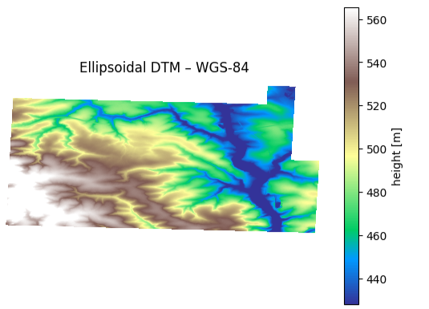

# dtm loader and converter to enable accurate terrain following using DJI drones
!Tested with DJI Mavic 3 Enterprise & DJI Matrice 350 RTK!

Small script that turns a pile of 1-metre German DGM raster tiles into a single, cloud-optimised GeoTIFF in geographic WGS-84 coordinates and ellipsoidal heights.
Can be used for any other tiles as well.

What it does
------------

1. **Download tiles**
   • Reads the Metalink catalogue .meta4 files
   • Uses `aiohttp` + `aiofiles` to fetch every listed GeoTIFF 
    

2. **Mosaic in UTM32N or any other CRS**  
   • Merges the tiles with Rasterio

3. **Vertical datum shift (DHHN2016 (or any other orthometric heights) → WGS-84 ellipsoid)**  
   • Loads the national geoid model  
   • Adds the geoid undulation to every pixel

4. **Re-project & COG**  
   • Calls `gdal.Warp` to transform the temp raster to EPSG 4326, bilinear
     resample, LZW-compress and tile.  
   • Output: a ready-to-serve GeoTIFF at native ground resolution.
   

# -> Now import this to DJI's remote controller!

Dependencies
------------

* GDAL ≥ 3.10 (`gdal` / `libgdal-core`)
* Rasterio 1.4
* NumPy ≥ 2.0
* aiohttp 3.12 · aiofiles 24.1
* tqdm 4.67

# Installation (Conda)
This package was developed and tested on Windows Server 2016 running python=3.9.
We use conda to create a new environment:

user@userpc: /dtm_loader$ conda env create -f environment.yml
conda activate dtm_loader
